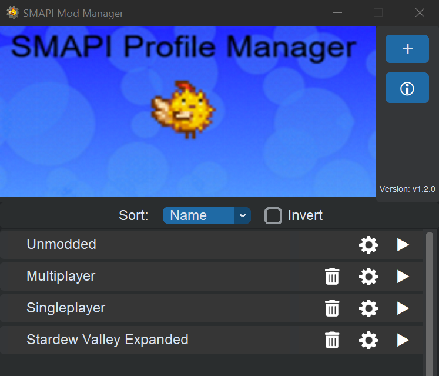

# SMAPI-Profile-Manager
 Allows you to quickly switch between different Stardew Valley mod profiles

## Setup
1. Download the [latest release](https://github.com/supercam19/SMAPI-Profile-Manager/releases/latest) of the profile manager
2. Extract the .zip file on your computer

You can run the .exe file directly to use the profile manager, or if you want to open it through Steam, complete the following steps:
1. In your Steam library, go to Stardew Valley
2. Press on the gear icon and click on properties
3. Under launch options, enter the following: 
`"<path\to\profile\manager>\main.exe" %command%` 
Where <path\to\profile\manager> is the path to the folder of the profile manager you previously downloaded
4. You're done! Just launch the game normally through steam and the profile manager will pop up.

## How to use
The profile manager is a very simple program that does most of the work for you. When you open the program for the first time, you can add a profile using the blue `+` button in the top right.

This will prompt you to choose a folder, which will be one of your mod profiles. (Please note that at the moment the folder has to be in your Stardew Valley install folder!)Select the folder and the profile manager will prompt you to give it a name.

Once that is done, you can repeat the process for as many different profiles as you wish You can then launch the game with different profiles using their launch button, or delete the profile with the delete button.

## Restrictions
- At the moment your game must be installed in the default location
`C:\Program Files (x86)\Steam\steamapps\common\Stardew Valley`, but this should be fixed soon.
- The folders of mods when adding profiles currently need to be inside the Stardew Valley folder, also something that should soon be fixed.

## Modifiying the program
The only external package needed for this program is [CustomTkinter](https://github.com/TomSchimansky/CustomTkinter), which can be installed with: 
`pip install customtkinter` 

When building the program back into an exe file, you can use the build.bat file, but be sure to replace the file path to the customtkinter with the one shown when you run 
`pip show customtkinter`